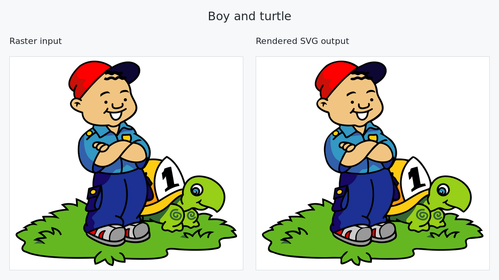
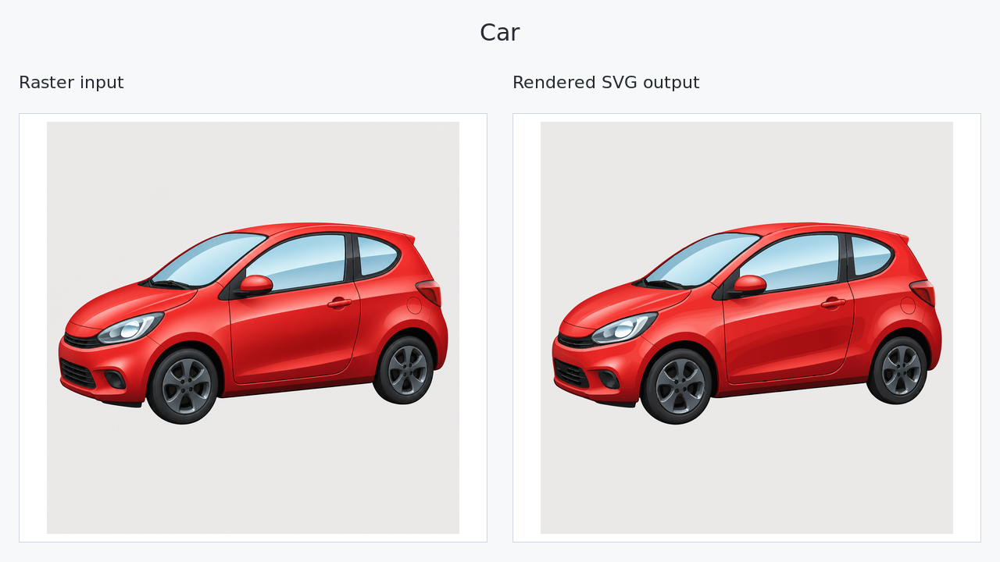
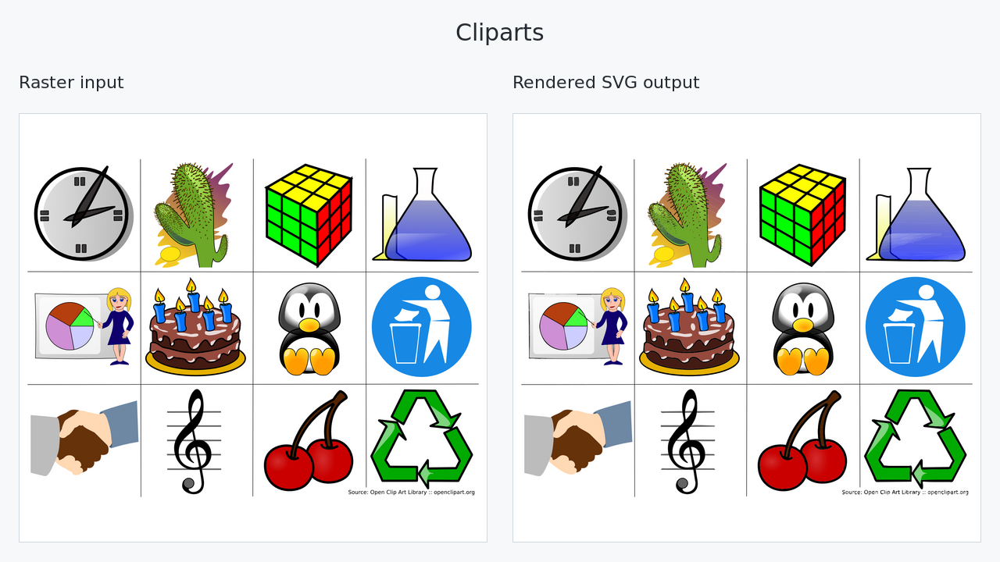
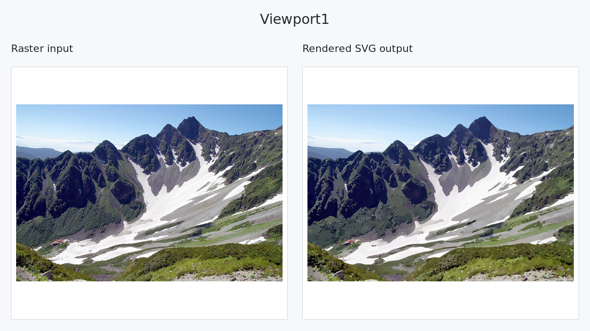
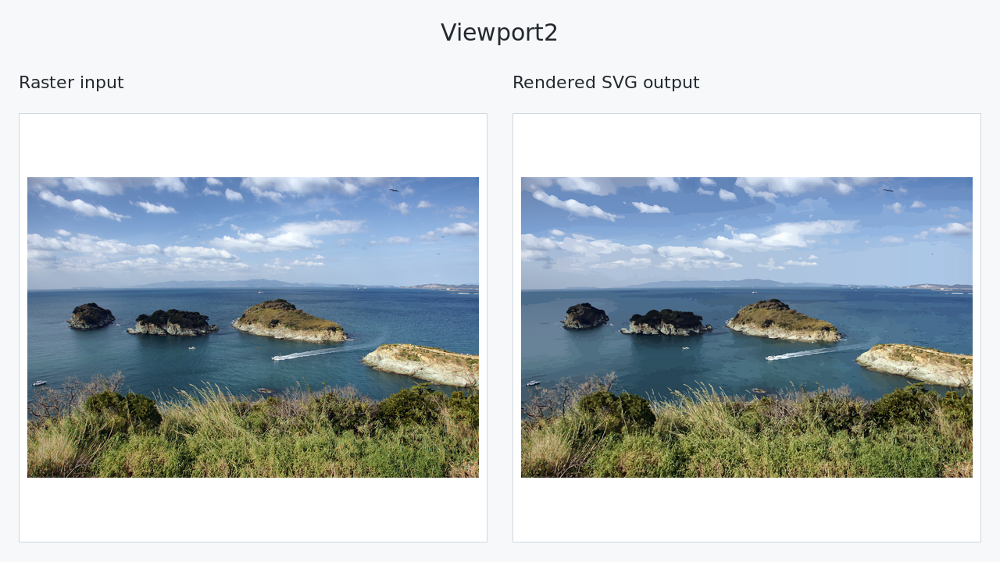

# picvec

Native Rust implementation of the perceptual, structure-aware raster-to-SVG
pipeline. It creates editable SVG Paint faces, Office-compatible solid/linear/
elliptical-radial fills (at most five stops), raster-derived shared topology,
analytic primitives, and source-supported structural centre-lines.

## Build

```bash
mise exec -- cargo build --release --locked
```

Diagnostic CLI options and JSON diagnostic output are available in builds
that enable the optional `diagnostics` feature:

```bash
mise exec -- cargo build --release --locked --features diagnostics
```

The converter uses the portable [`wide`](https://crates.io/crates/wide) SIMD
library across supported CPU architectures. It contains no vendored or
hand-written assembly and requires no assembly-specific build step.

## Run

```bash
picvec input.png output.svg
```

The input processing size is selected automatically from source complexity;
`--max-dimension` sets its upper bound. The only output is the SVG file named
by the second positional argument.

Useful controls:

```text
--max-dimension <PX>
--max-input-dimension <PX>
--max-input-megapixels <MP>
--max-decode-mib <MIB>
--smoothing-radius <PX>
--segmentation-min-size <AREA>
--quantization-dark-delta-e <DE>
--quantization-light-delta-e <DE>
--gradient-merge-error <DE>
--solid-color-max-delta-e <DE>
--threads <N>                 # 0: detected physical cores
--quality-metrics             # diagnostics feature: full-SVG DeltaE00/SSIM report
--verbose                     # diagnostics feature: JSON report on stderr
```

`--solid-color-max-delta-e` controls the within-region colour range that can
be accepted immediately as a solid fill. Lower values retain more subtle
shading as gradients; higher values favour simpler SVG output. The default is
1.5.

Input dimensions and total area are checked from the image header before
decoding (32,768 pixels per axis and 32 megapixels by default), and decoder
allocations have a 512 MiB best-effort limit.

`--verbose` prints the in-memory timing and complexity report to stderr for
development; it still writes no sidecar files.

`--quality-metrics` explicitly enables a second, complete in-memory SVG render
and reports DeltaE00 and SSIM. It is disabled by default because those metrics
are observational and never change the generated SVG. With `--verbose` they
are included in the complete report; otherwise only the metric object is
printed to stderr.

The published Rust crate contains only the converter source and its legal
documentation; sample images and the evaluation-only Real-ESRGAN model are
kept outside the crate. See `THIRD_PARTY_NOTICES.md` and `sample/README.md`
before redistributing those repository assets.

## Examples

Each comparison shows the source raster on the left and the corresponding SVG
rendering on the right. The committed comparison assets can be regenerated by
the optional `scripts/generate_sample_comparisons.sh` maintenance script. That
script currently uses librsvg and ImageMagick, but neither is a converter
runtime dependency.











## x4 evaluation

`scripts/evaluate.py` evaluates a completed SVG against a Real-ESRGAN x4
reference without feeding that image back into vectorization. A standalone x4
PNG can be created with SVGDeck's migrated PyTorch/Spandrel generator:

```bash
timeout 600s nice -n 10 mise x -- uv run scripts/generate_realesrgan_x4.py \
  input.png reference-x4.png \
  --model /path/to/RealESRGAN_x4plus_anime_6B.pth
```

See `scripts/picvec_eval/README.md` for NCNN and PyTorch evaluator usage,
content-addressed caching, and reproducibility controls. The evaluator's
separate SVG rasterization step currently uses `rsvg-convert`.

## Pipeline

1. Check the input size, choose a suitable working resolution, and resize the
   raster when needed.
2. Detect colour regions, boundaries, shading, and thin structural lines.
   Correct antialias pixels and merge only neighbouring regions that can share
   one fill without losing a visible boundary.
3. Fit each region with a solid colour or a linear/radial gradient. Neighbouring
   gradients are adjusted when doing so produces a smoother result.
4. Convert region boundaries into shared vector curves. Adjacent regions reuse
   the same curve, and simple regions become rectangles, circles, or ellipses
   when it is safe to do so.
5. Render the Paint layer once with embedded `resvg`, then add structural lines
   that are still missing from that preview.
6. Add a small overlap between Paint regions to hide renderer seams and write
   the final editable SVG atomically to the requested path.
