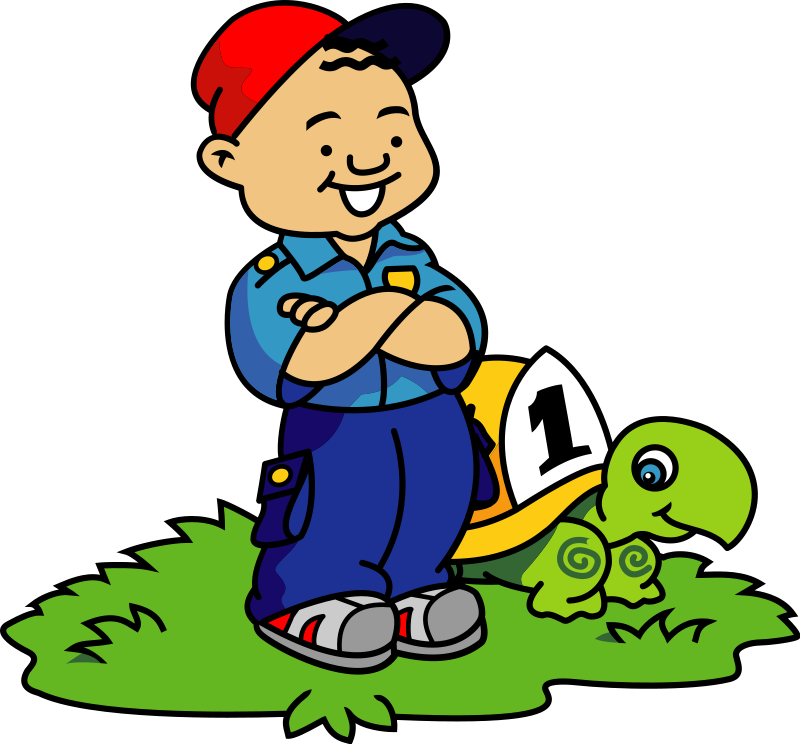
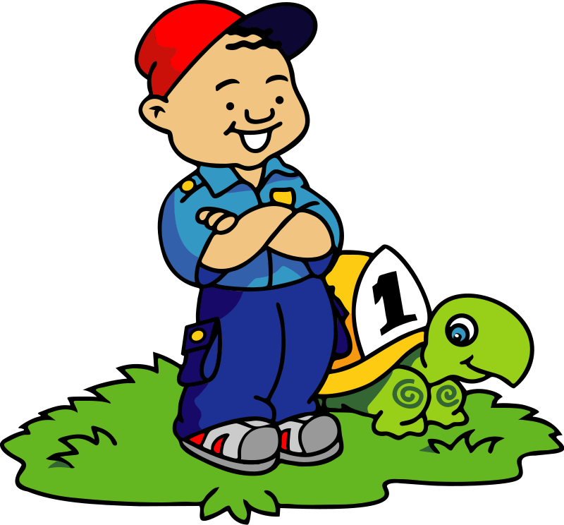
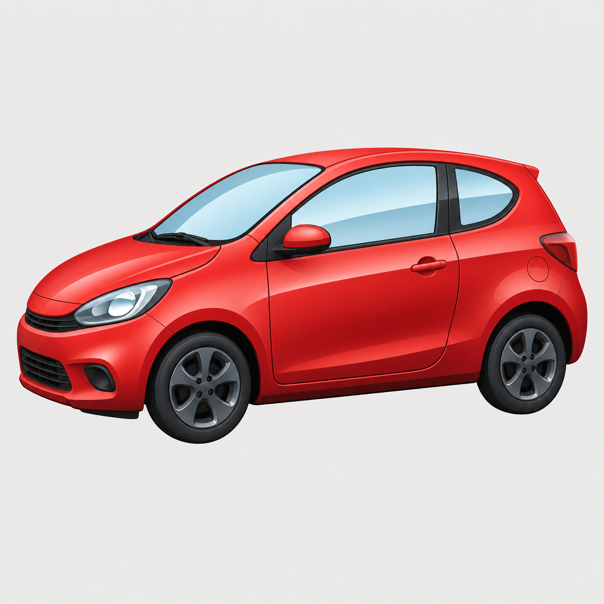
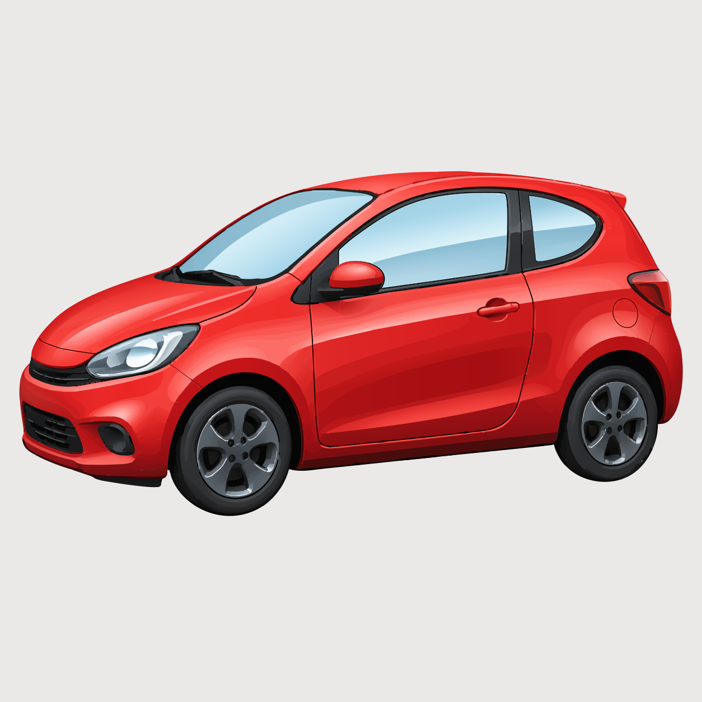
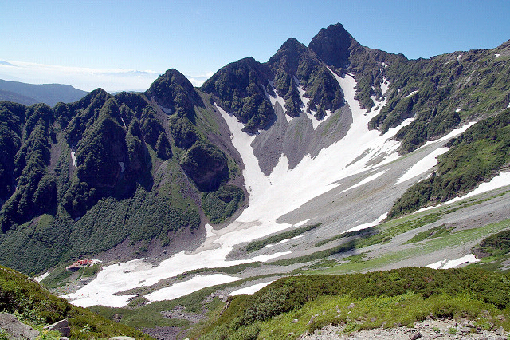

# picvec

picvec converts raster images into editable SVG using Rust. Output consists of
painted paths, geometric primitives and supported structural lines, with solid
colours or linear/radial gradients. The converter uses the original image as
its reference.

## Build and convert

```sh
mise exec -- cargo build --release --locked
./target/release/picvec input.png output.svg
./target/release/picvec --help
```

The second argument is the exact SVG file to write. The converter writes it
atomically. It embeds `resvg` for internal rendering and uses portable `wide`
SIMD.

Completion reports the dimensions, **final SVG object count**, **path contour
count** (`subpaths`) and elapsed time. Groups and definitions are excluded from
the object count. A compound path is one object even when it contains many
`M`/`m` contours; the contour count makes that distinction visible. These counts
come from the final SVG, including accepted source refinements.

| Option | Purpose and default |
| --- | --- |
| `--max-dimension <PX>` | Maximum automatic **base** processing dimension (1600). Source refinements may be larger. |
| `--no-adaptive-refinement` | Disable source-resolution refinement. |
| `--adaptive-svg-budget-mib <MIB>` | Additional SVG byte budget for refinement (0: unlimited). Quality and efficiency checks still apply. |
| `--remove-chroma-key-background` | Detect and remove a saturated red, green, blue, cyan, magenta or yellow backing. |
| `--paint-merge-passes <N>` | Paint merge passes, 1–8 (1). |
| `--oklab-palette-threshold-scale <FACTOR>` | Palette tolerance multiplier in 100-scaled OKLab units (1.0). |
| `--threads <N>` | Worker count (0: half the detected CPUs, at least 1 and capped at 10). |
| `--max-input-dimension <PX>` | Maximum source width or height (32768). |
| `--max-input-megapixels <MP>` | Maximum source area (32). |
| `--max-decode-mib <MIB>` | Best-effort decoder allocation limit (512 MiB). |

Enable the optional diagnostic build for `--verbose` (stage timings and JSON
summary) or `--quality-metrics` (completed-SVG OKLab/SSIM measurements):

```sh
mise exec -- cargo build --release --locked --features diagnostics
./target/release/picvec input.png output.svg --verbose
```

Diagnostic output goes to stderr. Segmentation and geometry diagnostics describe
the base processing stages; the final object/contour counts describe the complete
emitted document.

## Processing order

All images and adaptive source refinements use the same vectorization core.

1. Decode and validate the source, distinguish paint opacity from edge coverage,
   and select the base resolution.
2. Analyse boundaries, shading and thin lines. Build material ownership and
   absorb locally supported antialias fragments into their incident regions.
   Preserve source-supported dots, highlights, colour and opacity boundaries.
3. Fit solid/gradient paints and merge compatible ownership before tracing.
   Narrow chromatic-rim recovery supplies ordinary ownership labels before
   alpha partitioning.
4. Construct shared boundaries and fit curves or geometric primitives. Adjacent
   faces reuse their common boundary. Authored transparency stays in paint.
5. Determine paint order from line width, elongation and source contrast, then
   construct overlap beneath later faces to prevent seams. Validate ordering
   and covered-hole simplification against rendered source evidence. Retain
   structural lines only when they contribute to the painted result.
6. Remove invisible contributions and serialize the core result. For downscaled
   inputs, evaluate finer source candidates through this same core. Accept only
   candidates that pass the common quality-gain, missing-edge and SVG-cost checks.
7. Compose accepted refinements, discard superseded base geometry when the whole
   canvas is replaced, count the final drawing elements and write the SVG.

When no safe local refinement core exists but background/foreground separation is supported
by the source, the complete source can be evaluated as a candidate. Images with
no such separation evidence retain the selected global model. This preserves one
model for connected strokes and gradients, but can be much slower than the base
conversion. A configured SVG budget limits accepted additional output bytes.

### Transparency and visible geometry

- Alpha is expressed by fill/stroke opacity or gradient-stop opacity.
- Edge coverage informs the fitted visible contour.
- Geometric clipping may delimit adaptive source replacements or stroke outlines.
  Local colour reconstructions explicitly composite each RGBA paint and the
  completed patch before clipping, using a neutral sRGB filter and opaque boundary
  support. Boundary colour matching preserves source alpha.
- Redundant regions should be merged before fitting. Final visibility checks
  remove contributions only when the rendered RGBA result permits it. Useful
  partial overlaps and authored translucent details remain.

## Samples

`cliparts-6x6.png` uses the sample's explicit
`--remove-chroma-key-background` setting. Other samples use the normal defaults.

| Sample | Original | SVG |
| --- | --- | --- |
| Boy and turtle | [](sample/input/boy_and_turtle.png) | [](sample/output/boy_and_turtle.svg) |
| Car | [](sample/input/car.png) | [](sample/output/car.svg) |
| Viewport 1 | [](sample/input/viewport1.jpg) | [](sample/output/viewport1.svg) |

| Input | Editable output | Comparison | Objects | Path contours |
| --- | --- | --- | ---: | ---: |
| [Booster layout](sample/input/booster-layout.jpg) | [SVG](sample/output/booster-layout.svg) | [PNG](sample/comparison/booster-layout.png) | 16,445 | 24,614 |
| [Boy and turtle](sample/input/boy_and_turtle.png) | [SVG](sample/output/boy_and_turtle.svg) | [PNG](sample/comparison/boy_and_turtle.png) | 80 | 128 |
| [Car](sample/input/car.png) | [SVG](sample/output/car.svg) | [PNG](sample/comparison/car.png) | 853 | 952 |
| [Cliparts](sample/input/cliparts.png) | [SVG](sample/output/cliparts.svg) | [PNG](sample/comparison/cliparts.png) | 4,692 | 14,060 |
| [Cliparts 6×6](sample/input/cliparts-6x6.png) | [SVG](sample/output/cliparts-6x6.svg) | [PNG](sample/comparison/cliparts-6x6.png) | 29,282 | 30,722 |
| [Still life](sample/input/vectorization-stress-still-life.png) | [SVG](sample/output/vectorization-stress-still-life.svg) | [PNG](sample/comparison/vectorization-stress-still-life.png) | 13,897 | 18,877 |
| [Viewport 1](sample/input/viewport1.jpg) | [SVG](sample/output/viewport1.svg) | [PNG](sample/comparison/viewport1.png) | 5,652 | 6,258 |
| [Viewport 2](sample/input/viewport2.jpg) | [SVG](sample/output/viewport2.svg) | [PNG](sample/comparison/viewport2.png) | 30,500 | 35,501 |
| [Wikipedia logo](sample/input/wikipedia_logo_1_0.png) | [SVG](sample/output/wikipedia_logo_1_0.svg) | [PNG](sample/comparison/wikipedia_logo_1_0.png) | 1,917 | 2,623 |

## Optional x4 evaluation

The Python evaluator compares a completed SVG with a Real-ESRGAN x4 reference.
Models are supplied separately. Transparent inputs use a white
evaluation background by default.

See [the evaluator guide](scripts/picvec_eval/README.md) for NCNN/PyTorch setup,
model paths, source/reference matching, caching and reproducibility controls.
