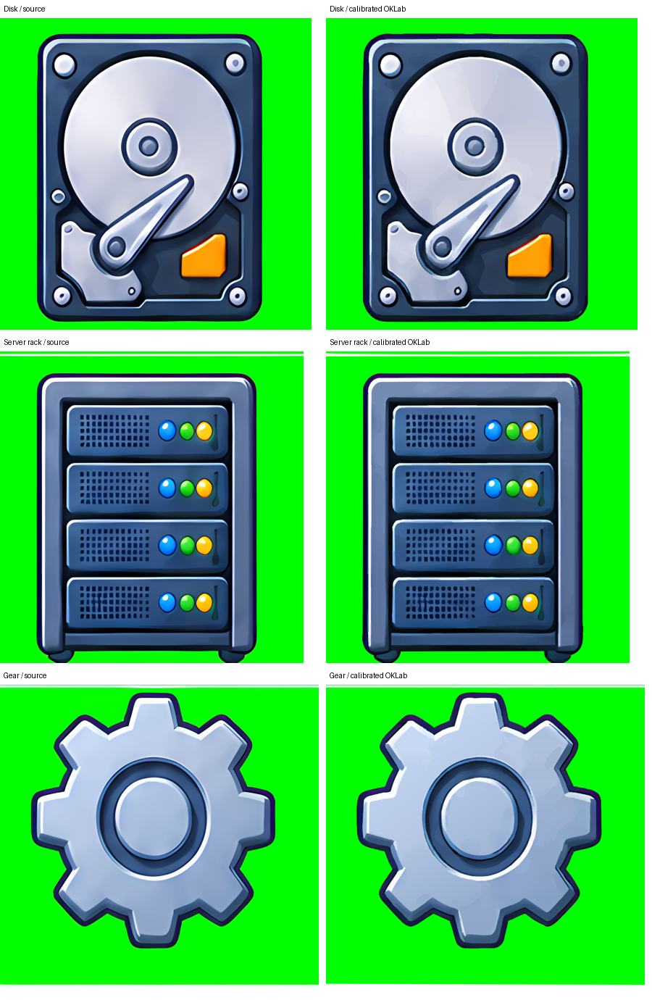

# cliparts-6x6 の細部補正の再確認

冒頭の数値は背景除去オプションを復元した時点の記録。現在の再調整版の結果は末尾に記録した。

前回の再生成では、以前使用していた `--remove-chroma-key-background` が
省略されていた。背景色除去は、この画像では区切り線の分離と図形単位の
高解像度補正の候補抽出にも影響する。緑背景を通常の不透明画像として扱った
結果、ディスク・サーバラック・ギアなどが補正候補に入らなかった。
旧 SVG にある `data-source-separators` と背景の透明度、補正領域の位置を照合した。

以前のオプションを復元した OKLab 版では、候補36領域がすべて評価・採用され、
品質・複雑度・容量による却下は0件となった。前回の採用数は27領域だった。
今回の修正は再生成条件の復元と、その条件を記録する生成スクリプトの追加であり、
色差閾値や変換アルゴリズムの変更は行っていない。

## 指定部分の比較

元画像と各 SVG を元解像度で比較し、緑背景と境界のにじみを除いた図形内部の
平均 OKLab 色差を測定した。旧 CIELAB 出力も同じ OKLab 指標で再評価している。
数値が小さいほど元画像に近い。比較対象の領域・マスク条件・ハッシュ・p90 は
[計測データ](cliparts-6x6-refinement-results.json)に記録した。

| 部分 | 旧 CIELAB・従来設定 | 前回 OKLab・オプション欠落 | 修正後 OKLab・従来設定 |
| --- | ---: | ---: | ---: |
| ディスク | 1.626 | 4.879 | 1.495 |
| サーバラック | 1.921 | 5.640 | 1.833 |
| ギア | 1.365 | 3.519 | 1.313 |



３箇所とも高解像度補正に含まれることと、円周・通気孔・ギアの輪郭の改善を
確認した。この３領域では修正後の平均色差は旧 CIELAB 出力よりも低い。

## 再生成

```bash
scripts/generate_sample_svgs.sh cliparts-6x6.png
scripts/generate_sample_comparisons.sh
```

SVG 生成スクリプトはサンプル固有のオプションを保持する。引数を省略すると
`sample/input` の全ファイルを再生成する。元画像は変更しない。

## car 再調整後の再生成

今回も背景除去を有効にし、36候補をすべて評価・採用した。品質・複雑度・容量による却下は0件。元解像度5016×5016へ描画し、上と同じ内部マスクで再計測した。

| 部分 | 導入前 CIELAB | 再調整 OKLab |
| --- | ---: | ---: |
| ディスク | 1.626 | 1.601 |
| サーバラック | 1.921 | 1.944 |
| ギア | 1.365 | 1.285 |

高解像度補正が欠落する問題は再発していない。サーバラックの平均色差は導入前よりわずかに大きく、すべての部分で色差が改善したとは評価しない。上の画像は現在の再生成結果に更新した。ハッシュと数値は結果JSONの `current_calibration` に記録した。
