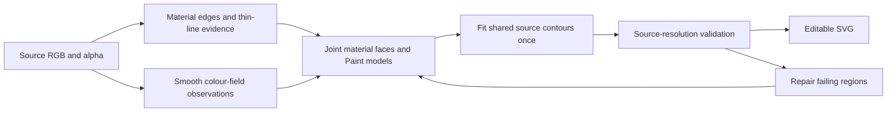

# Replacing the vectorization pipeline

The three experiments in [performance-prototypes.md](performance-prototypes.md)
are rejected as adoption candidates: they did not establish a substantial
end-to-end speedup. This document proposes a replacement architecture. It does
not report an implemented replacement or a measured speedup for it.

The selected next direction is now the 2025 gradient reconstruction research.
See [the integration design](gradient-reconstruction-integration.md) for the
paper-to-code mapping, reference implementations and compatibility work.

The constraints remain the same CPU worker count, source detail preservation,
editable vector output, and the current solid/linear/elliptical-radial Paint
vocabulary with at most five stops per gradient. GPU inference and embedded
rasters are not assumptions of the proposed implementation.

## What the measurements rule out

The frozen comparison revision is
`c5b68b5a5ef9764797c055779b348b52deb201ec`. The numbers below are calculated
from the baseline runs in [the recorded data](performance-prototypes-results.json).
They describe that revision, not the concurrently changing working tree.
Two repetitions had appreciable host timing variation; these are approximate
engineering budgets, not confidence intervals or predictions.

Eliminating the entire `paint-fitting` stage would only provide 1.34x on the
photograph, 1.35x on the car, and 1.47x on the window. A cheaper scorer or fitter
alone cannot reach 2x on those measurements. The car's initial Paint search
also accounted for only about 2.50 seconds of its 6.86-second Paint stage;
harmonization and coupling accounted for another 4.08 seconds. These substage
figures come from the original baseline diagnostic logs in
`/tmp/picvec-prototypes/results/{sample}-baseline-{repeat}.log`.

The replacement must cover a substantially larger part of the computation.
Define the current core as these non-overlapping top-level timing stages:

```text
segmentation
boundary-regularization
paint-aware-merge
thin-paint-ownership
paint-topology-preservation
paint-fitting
source-supported-paint-merge
shared-geometry
```

| Input | Total (s) | Current core (s) | Core share | Replacement core budget for 2x (s) |
| --- | ---: | ---: | ---: | ---: |
| viewport1 photograph | 18.083 | 14.564 | 80.5% | 5.522 |
| car | 26.296 | 20.381 | 77.5% | 7.233 |
| window | 13.585 | 11.863 | 87.3% | 5.070 |
| boy_and_turtle | 3.270 | 1.674 | 51.2% | 0.039 |
| stress | 1.020 | 0.515 | 50.5% | 0.005 |

For total time T and current core time C, the budget is `T/2 - (T-C)`.
It must include new segmentation, fitting, geometry, and any **additional**
validation and repair. A hypothetical fourfold reduction of this whole core
would produce approximately 2.53x, 2.39x and 2.90x on photograph, car and
window respectively, if the other stages stayed unchanged. This is a
conditional arithmetic result, not an expected or achieved speedup.

The small inputs expose a second limitation: their full-image edge, smoothing
and structural passes must also change to reach 2x. Simply shrinking their
already small Paint partition cannot meet the overall objective.

## Recommended architecture: construct material faces and their Paint together

Current `pipeline.rs` creates colour labels, regularizes them, fits merge
proposals, restores Paint ownership, splits shading patches, fits their Paint,
harmonizes/couples neighbouring Paint, merges again, and finally fits geometry.
Intermediate colour bands can induce both extra model fits and extra boundary
work. This is an architectural diagnosis supported by the call graph; the
fraction of removable boundaries still needs measurement.

The proposed replacement has two persistent objects: a material boundary graph
and continuous Paint fields attached to its faces. A shading change represented
by the same field need not create a geometric boundary.



This is a new execution path producing final geometry and Paint. Sending its
intermediate observations back through `build_palette`, `merge_partition`,
`fit_all_without_topology` and the existing repair sequence would repeat the
failure of the previous prototypes.

### 1. Segment by material discontinuities and model error

Build candidate smooth domains using local spatial differences and native
boundary evidence. Retain explicit separation constraints between opposite
sides of material boundaries, including boundaries connected through another
route in the image. Connected components of an edge mask alone are insufficient
because contours can be open and shallow shading can connect different objects.

Use a compact adjacency graph and constrained cuts to resolve those domains.
Graph nodes carry observations for a spatially varying colour model; they are
not globally quantized palette entries. A gradient ramp can therefore become
one domain even when its endpoints have very different colours. The graph can
still require subdivisions and cuts: the work being removed is repeated
expensive Paint fitting for neighbouring merge proposals, not all graph work.

Separation constraints, uncertain edges and fit residuals must remain available
throughout the process. Multi-terminal cuts are not automatically cheap; graph
size, number of cut calls, and their actual time are explicit prototype counters.
A bounded local approximation is acceptable only with the same final source
checks. Failed checks require repair, and that cost counts against the budget.

### 2. Recover the colour field before creating shading boundaries

On each candidate domain, estimate a solid, linear or allowed elliptical-radial
field directly. Linear direction is estimated from local colour derivatives;
the radial model uses derivative directions to constrain its centre and scale.
Then reduce colour fitting to the one-dimensional coordinate of the chosen
gradient. Fit stop colours and locations under the existing five-stop limit.

This differs from the rejected RGB-plane shortcut: it covers radial geometry
and piecewise gradient profiles, including profiles that reverse direction in
colour space. More importantly, this fitter defines the domain's Paint from
the start. It is not an early candidate preceding the old exhaustive search.

RGB residuals and derivative alignment may guide proposals, but acceptance
uses source colour error and structural checks. A general RGB affine plane
has two independent spatial colour directions and is not necessarily a legal
single SVG linear gradient. The emitted model must be checked as actually
rendered, not as an unconstrained surrogate.

If one field cannot explain a face, try the existing allowed layered Paint
representation or split where the source residual requires it. Retain accepted
models when making local changes; do not discard them and globally refit all
faces. Small bounded refinement steps need a recorded iteration count.

### 3. Keep shape precision independent of shading sample density

Perform a cheap source-resolution scan to preserve alpha transitions, narrow
dark/bright bands, small gaps and uncertain boundaries. Expensive profile and
curve operations should visit the resulting boundary bands. Smooth interiors
can use weighted coarse observations while retaining native source pixels for
validation. Narrow features cannot be represented solely by downsampled means.

Trace material boundaries into one shared graph, fit each contour once, and
reuse it on both sides. The project already has shared geometry, fitted
primitives and `Paint::Layered`; adding these features again is not a new
optimization. The intended change is to construct this graph **before colour
bands cause fragmentation**, retaining its identity through Paint fitting.
Adapt existing curve-quality machinery to this graph instead of rebuilding
all intermediate dense label rasters.

The cheap scan is also needed for the simple images in the budget table.
Leaving all dense edge/ridge/smoothing passes intact is a useful integration
milestone, but cannot establish a general 2x result.

### 4. Repair locally and account for its full cost

Render and validate against the source, including local tail error and line
connectivity. Repair only failed domains and their incident boundary bands;
preserve the shared boundary conditions at their interfaces. Patch composition
must retain colour and alpha ownership and cannot hide seams with extra blur.

The current pipeline may be used as a local fallback. Running it for the whole
image after paying for the new path would erase the intended gain. Record the
time and area of every fallback, with an early cost estimate for difficult
images. A preflight rejection may retain existing quality, but counts as no
speedup. A repair budget must never silently turn into discarded source detail.

In particular, photographic texture may not compress into a small number of
the allowed Paint models. Region count reduction is a hypothesis to test on
the photograph as well as illustrations, not an assumption or an excuse to
drop that input from the comparison.

## Research and alternative architectures

**Direct discontinuity-aware gradient reconstruction** is the closest research
basis. Chakraborty et al. use discontinuity-constrained segmentation, gradient
parameter estimation and a shared curve network. Their Table 1 reports 2.05 s
at 1024x1024, but this is not a comparison against picvec: hardware/worker
equivalence has not been established, their quality metrics differ, and their
gradient stop count is not limited to five. Their constrained graph problem
also needs a heuristic sequence of cuts. Adopt the separation of geometry and
colour fields as a research basis; do not transfer its timing or thresholds as
a performance or quality guarantee. The design above is a proposed adaptation
to this repository's stricter output and source-detail requirements.
([Paper](https://techmatt.github.io/pdfs/imageVectorizationViaGradientReconstruction.pdf),
[publisher record](https://diglib.eg.org/items/b9874008-ddbd-4bf5-ba91-041c9cfadf34).)

**Predict the whole representation with a trained model** is a materially
different alternative. A compact CPU model could propose material regions,
boundary fields and gradient parameters in one inference, with deterministic
native-source validation and local repair afterwards. Training could use
synthetic SVGs rendered with known geometry and the allowed Paint vocabulary.
This replaces repeated search with offline training; learning only a merge
score retains too much of the old workload. However, CPU latency, domain
coverage and repair frequency must be established. SuperSVG demonstrates
learned path synthesis, but its current implementation recommends CUDA for
practical speed and defaults to 512x512. Its existence does not establish a
CPU-only solution for picvec. This is a higher-investment research alternative,
not a ready replacement. ([Official implementation](https://github.com/sjtuplayer/SuperSVG).)

**Differentiable rendering of a small layer stack** could jointly optimize
geometry and shading. There is published gradient-aware layer vectorization,
but its per-image iterative renderer optimization is itself significant work.
It provides a representation alternative, not evidence of faster execution
under the fixed CPU budget. A CPU implementation would need to count all
iterations and renders. ([Zhou et al.](https://arxiv.org/html/2408.15741v1).)

**Gradient meshes or diffusion curves** change the representation still more
radically, making a smooth field independent of many filled regions. However,
they are not primitives in picvec's current output vocabulary. Converting the
result back to five-stop linear/radial fills adds another approximation and
partitioning problem; emitting many flat triangles loses the intended
editability and may increase SVG size. This is conditional on an output-format
change, not the recommended path under the existing contract. Layer
decomposition using ordinary gradients is also relevant, but the published
2023 method takes segmentation as input and searches supporting layer trees;
it does not remove picvec's segmentation problem by itself.
([Gradient layer decomposition](https://cragl.cs.gmu.edu/gradientlayers/).)

## Next implementation and rejection gates

Implement one minimal complete replacement path with final SVG output before
expanding it. It must bypass the old core on accepted domains. A measurement
of only segmentation, model inference or fitting will not qualify.

1. Freeze a new common revision. Use the same four CPU workers, input settings,
   source sizes, alpha handling and adaptive-refinement policy in both paths.
   Time decoding, probes, validation, repairs, patch composition and writing.
2. First establish the budget on car, window **and photograph**. Measure
   intermediate/final domain counts, Paint fits, total boundary length, cut
   calls, full-raster passes, fallback time/area, SVG bytes and peak memory.
   These are diagnostic measurements; a region-count reduction alone is not
   an acceptance criterion.
3. Keep the previous colour/alpha regression screening limits; inspect local
   shading and original-resolution contours as well. Add explicit source-based
   checks for narrow-line contrast and width, line gaps, loops and alpha
   connectivity. The previous baseline already lost the faint stress-image
   lines, so byte equality or unchanged mean error cannot prove their retention.
4. Proposed adoption gate: at least 2x end-to-end geometric-mean speedup on the
   fixed suite, no sample more than 10% slower, and no material quality
   regression. Report every per-image result, including preflight rejection
   and full fallback. Use at least five interleaved repetitions in a quiet
   environment; expand the suite to the full clip-art sheet, additional
   photographs, tonal-detail and ellipse/line regressions before promotion.
5. If source validation or five-stop conversion brings the result below that
   gate, reject it as an architectural speedup. Do not resume tuning isolated
   evaluators and present another few-percent change as the requested result.

The 2x gate is a proposed interpretation of a substantial improvement, not a
measured outcome or a claim that every source can be represented more cheaply
at the same fidelity. The immediate engineering decision is to test a whole
replacement of the dominant work, with an explicit failure criterion.
