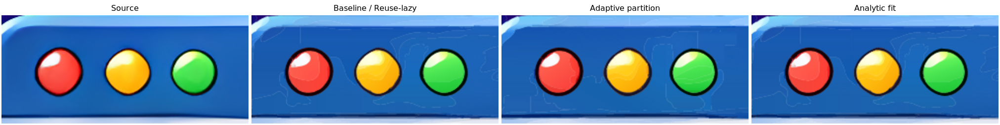
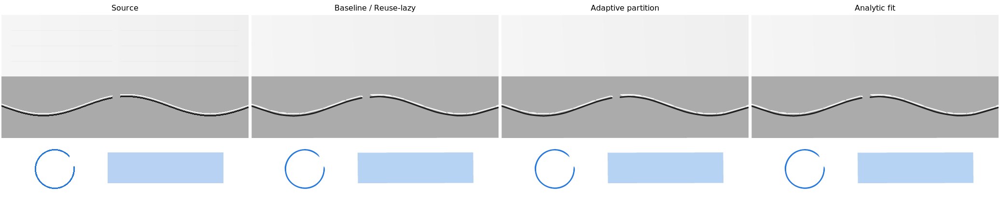

# Three independent algorithm prototypes

These variants are rejected as adoption candidates because the end-to-end
improvement was insufficient. Their feature flag, source modules, CLI controls
and dedicated comparison tools have been removed. This document and its
measurements/images remain as historical records.
See [the replacement architecture review](fundamental-performance-redesign.md)
for the revised direction and performance budgets.

The comparison base is `c5b68b5a5ef9764797c055779b348b52deb201ec`.
At the time of the comparison, these experiments were compiled only with `performance-prototypes`, which also
enables diagnostics. The default is `--prototype baseline`; ordinary builds
have neither this CLI option nor the experimental Config field. None of the
experiments changes the configured CPU worker count.

## Implementations

1. **reuse-lazy** caches the source Lab observations for the union and both
   children of each merge proposal. Two-stop merge models are ranked by the
   original RGB MSE first; perceptual error statistics are evaluated lazily and
   cached for the three finalists. The existing rescue pass computes remaining
   scores only if required. Original candidate ordering, merge thresholds and
   tie-breaking are retained. This is a local prototype of deferred evaluation,
   not a replacement of the complete graph priority queue.
2. **adaptive-partition** starts with the canvas and recursively divides cells.
   A cell of at least 4x4 pixels can share a mean palette observation only when
   it contains no detected face/ridge barrier and *every* pixel is within half
   the tonal-adjusted palette tolerance of the mean. Smaller or rejected cells
   keep the original observations. Original source Lab is retained for later
   validation. The existing palette and topology machinery then consumes these
   observations. This prototypes top-down aggregation of flat interiors; it
   does not yet create whole gradient regions directly or replace downstream
   geometry with rectangles. Subsequent palette quantization can compound the
   approximation, so the local bound is not an end-to-end quality guarantee.
3. **analytic-fit** estimates a three-channel RGB plane, obtains its dominant
   colour-change direction, and refines the angle with three +/- coordinate
   search steps (15, 7.5, 3.75 degrees). Each step refits the colour stops with
   the existing solver. It applies only when the plane explains at least 80%
   of RGB variance. A candidate must reduce mean perceptual error by at least
   40% relative to Solid and pass the original gradient promotion criteria;
   otherwise the full original search runs. This prototype accelerates linear
   gradients; radial and poorly modelled data use the original search. Passing
   these checks does not prove that an unsearched candidate was not better.

Counters in verbose output include preliminary resolution probes and adaptive
patches, so they are process totals rather than final SVG element counts.
For reuse-lazy, the eager reference would score nine geometries per lazy fit.

## Historical reproduction procedure

The commands below describe the removed tooling and do not run against the
current tree. The comparison base identifies the baseline, not a revision
containing the experimental code.

```bash
mise exec -- cargo build --release --locked --offline \
  --features performance-prototypes --bin picvec --example prototype_metrics -j 2
python3 scripts/compare_performance_prototypes.py \
  --binary target/release/picvec \
  --metrics target/release/examples/prototype_metrics \
  --threads 4 --repeats 2 --output target/prototype-comparison
```

An optional `--reference /path/to/original/picvec` verifies that the experimental
binary in baseline mode produces byte-identical SVGs to a production binary.
This reference must have the same nonexperimental source revision.

The runner uses one conversion process at a time and reverses mode order for
the second repetition. It saves each SVG, full timing report, output SHA-256,
region count and instrumentation counters. All modes use the same CLI quality
settings. White/black composited source-resolution SVG rendering and quality
measurement occur **after** all timed conversions. Conversion timings include
normal internal preview renders because they influence the converter's output.

Inputs are a photograph, car illustration, transparent boy/turtle illustration,
an 836x836 window crop from the large clip-art sheet, and a generated 512x384
stress image. The window remains opaque and retains its source green background.
The stress image includes faint interrupted lines, a bright curved line beside
a dark line, a broken opaque ring on transparency and a translucent rectangle.
All fixtures are generated reproducibly by the Rust example.

Metrics include mean/p90/p99 CIEDE2000, global luminance SSIM, source-edge
mean CIEDE2000, edge recall/precision with one-pixel positional tolerance,
alpha MAE/p99, and separate stress-image region errors. Edges here are a simple
five-code-value RGB contrast mask, not a semantic test of line connectivity.
Global SSIM alone is not treated as sufficient evidence of detail preservation.

For screening, flag mean DeltaE increases over 0.05, p99 increases over 0.5,
edge precision/recall drops over one percentage point, and alpha MAE increases
over 0.001 relative to baseline. Apply the colour-error checks to stress ROIs
as well. These thresholds select cases for visual review, not a universal
perceptual guarantee. Two repetitions are exploratory and cannot establish
small speed differences statistically.

## Results

Five inputs x four modes x two repetitions produced 40 timed conversions.
The experimental baseline matched the production executable byte for byte on
all five inputs. Every mode was deterministic across repetitions and reported
four execution threads. The frozen comparison excludes concurrent edits to
`geometry.rs` in the shared workspace.

Mean wall seconds (lower is better):

| Input | Baseline | Reuse / lazy | Adaptive partition | Analytic fit |
|---|---:|---:|---:|---:|
| Photograph | 18.08 | 16.63 | 17.12 | 17.44 |
| Car | 26.30 | 27.42 | 26.94 | 25.03 |
| Boy and turtle | 3.27 | 3.22 | 3.30 | 3.20 |
| Window crop | 13.59 | 13.36 | 13.26 | 13.89 |
| Detail/alpha stress | 1.02 | 1.02 | 1.05 | 1.00 |
| Sum of input means | 62.25 | 61.65 | 61.65 | 60.56 |

The sums correspond to nominal reductions of 1.0%, 1.0%, and 2.7%.
**These differences do not demonstrate a clear overall speed improvement.**
The photograph baseline ranged from 15.78 to 20.39 seconds and the car baseline
from 23.74 to 28.85 seconds. Even unchanged stages varied substantially between
runs. The raw data retains every run and stage; a small difference in these
means must not be interpreted as a statistically established ranking.
There is no evidence of a twofold or larger end-to-end gain in these prototypes.

### What each experiment demonstrated

- **Reuse / lazy:** all five SVGs are byte-identical to baseline. The photograph
  evaluates 47,400 two-stop perceptual scores instead of 104,058 (54.4% fewer);
  car and window reduce these scores by about 40%. Mean photograph Paint-aware
  merging falls from 2.13 to 1.74 seconds. That stage is only a fraction of the
  pipeline, so eliminating much of its evaluation work cannot alone provide a
  large overall gain. Full graph-level deferred proposals are a separate,
  more extensive design problem; this test measures local deferral and reuse.
- **Adaptive partition:** 84.3% of car pixels receive an accepted cell mean,
  but final regions increase from 1,726 to 1,732. Car SVG bytes increase 9.8%;
  window bytes increase 6.8%. The photograph aggregates only 0.85% of pixels.
  Safe flat-interior aggregation therefore does not address the dominant
  work on these images. A gradient-aware top-down partition would need to
  reduce actual final Paint regions, not merely palette observations.
- **Analytic fit:** accepted early exits are 3/1,295 attempts for the photograph,
  49/748 for the car, 52/509 for the window, and zero for boy/turtle and stress.
  Most regions still need the original search. The baseline already estimates
  continuous linear directions and shortlists Office models, which limits
  the additional work this local angle optimization can remove. Window Paint
  fitting increases from 4.36 to 4.58 seconds in the measured means.

### Quality and visual review

All three modes remain within the declared relative screening limits on both
white and black, including stress-image ROI checks. Reuse/lazy is exact.
Adaptive partition and analytic fit produce byte-identical boy/turtle and
stress SVGs but change the photograph, car and window.

Changes in white-background mean CIEDE2000 (negative is better):

| Input | Adaptive partition | Analytic fit |
|---|---:|---:|
| Photograph | +0.01260 | +0.00013 |
| Car | -0.01166 | +0.00109 |
| Window | -0.02834 | -0.00119 |

The largest mean increase across either background is +0.01260 for adaptive
partition and +0.00159 for analytic fit. The raw file also records tail error,
edge precision/recall, alpha error and SVG size; mean error alone is not the
acceptance criterion.



The window comparison exposes changes in shading subdivisions and outline
shape. None of these experiments removes the pre-existing small shading
fragments around the controls.



The stress render is exactly the same in all four modes. The authored gap in
the bright/dark curve and the transparent broken ring remain visible, and the
translucent rectangle remains translucent. However, the faint horizontal lines
in the top band are already lost by the baseline. Identical output here means
no additional regression, not perfect preservation of the source details.

### Decision

Keep all three as opt-in experiments; do not promote any to the default on
this evidence. Reuse/lazy has the strongest output-preservation evidence and
measurably reduces evaluation count, but its end-to-end benefit needs steadier
measurement. The other two would need a broader redesign to reduce model or
region count materially; simply relaxing their guards could hide details.

[Machine-readable runs and quality measurements](performance-prototypes-results.json)
contain input/binary SHA-256 hashes and per-process counters. SVGs and full-size
renders can be regenerated by the runner. The displayed panels use the saved
native renders, composited over white; the window is cropped at
`250x110+140+100` and enlarged 2x.

Validation: experimental unit tests cover exact eager/lazy choices and error
statistics, protected and unmarked thin features during cell aggregation, and
analytic fitting of a rotated colour ramp versus texture. The shared-workspace
suite passes 198 tests (three ignored), and Clippy with warnings denied passes
both diagnostic-only and experimental builds. Formatting and diff checks pass.
